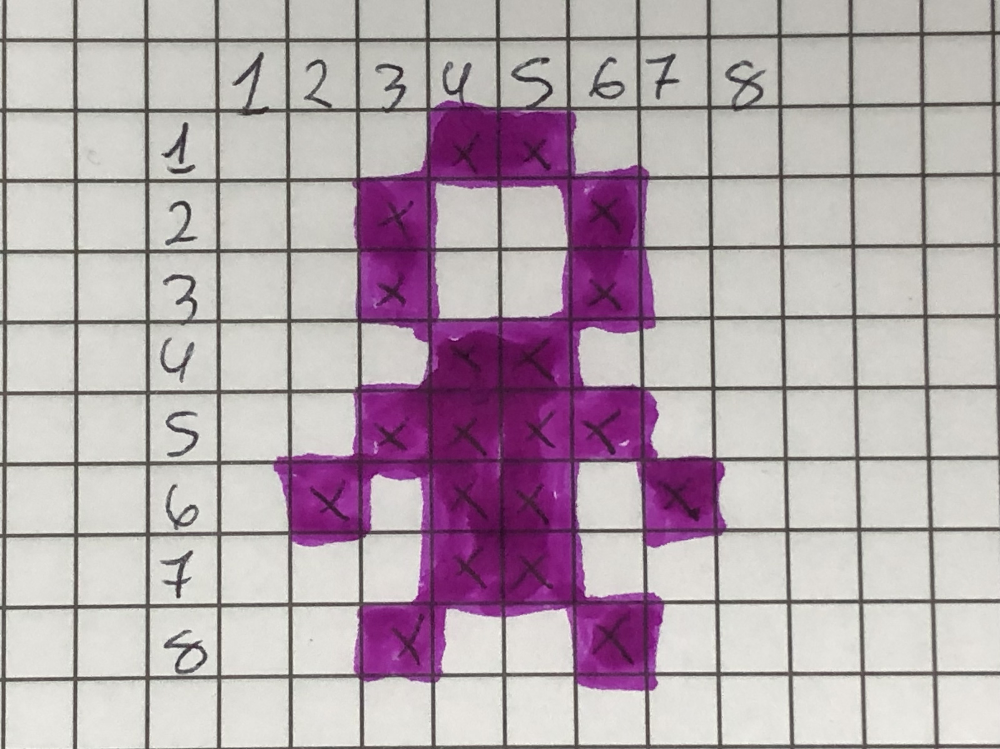

# Como fazer imagens de 1 bit

- primeiro passo você ira pocurar a imagem desejada.  

eu por exemplo procurei no google imagens de 1 bit e apareceu varias imagens e eu escolhi está.

então resolvi fazer a imagem de baixo do bonequinho  que está de frente.


- segundo passo é fazer a imagem preenchendo os quadrinhos.




- terceiro passo escrever os números em binario os quadros que tiverem preenchidos você ira escrver número 1 e os quadrados em branco você escreve 0.


## Como compactar a imagem
 Primeiro você irá olhar na primeira linha quantos quadrados brancos em sequência ela tem e vai escrever.
 
 Por exemplo, no desenho, a primeira linha tem 3 quadrados brancos. Então você vai escrever: 3

 Depois, você irá olhar quantos quadrados pintados em sequência a linha tem e vai escrever.
 
 E depois você repete até o final de cada linha.

Vai ficar assim:

``` 
3,2,3
2,1,2,1,2
2,1,2,1,2
3,2,3
2,4,2
1,1,1,2,1,1,1
3,2,3
2,1,2,1,2
```

> Lembrando que tem que começar sempre pelos brancos e depois os pintados. Depois os brancos, os pintados e assim por diante.
>
> Se a linha do desenho não começar com brancos, a gente escreve 0 para identificar que sempre tem que começar escrevendo quantos brancos tem no começo na linha.

E assim você ira fazer com todas as linhas do desenho até você terminar e assim outra pessoa conseguira desenhar e saber a imagem que vc desenhou.


## imagem secreta
``` 
3,2,3
2,4,2
1,6,1
0,2,1,2,1,2
2,1,2,1,2
1,1,1,2,1,1,1
0,1,1,1,2,1,1,1
``` 

